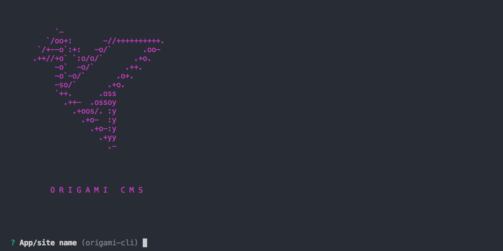

# "origami-cli"

Origami CLI is a tool that makes building websites for Origami CMS even easier.

## Getting Started
**Installation**

Install Origami CLI globally on your machine for easiest use:

`yarn global add origami-cli` 

or 

`npm install -g origami-cli`

This will install a global tool that you can run from anywhere with the command `origami`.

## What origami-cli does?
It allows developers to quickly create and deploy Origami based website. Currently the CLI can create the following sites:
- Hello World
- Todo App

## Commands
`origami`

By default, running `origami` in your shell will run the `origami run` command.

`origami run`

Runs the Origami app in the current directory. This command looks for the `.origami` file, and if it cannot be found, will exit.

Usage: `origami run`

`origami new [directory]`

Create a new installation of Origami, downloads the packages, and sets up the `.origami` file.

- Usage: `origami new my-site`

**Options:**

`directory`

Optional parameter to initialize the app in a new directory. You can use nested folder structure here to for path's that don't yet exist. 

EG: `origami new path/to/new/folder`.

**Help**

Run `origami help` to see a full list of the commands and flags.

## Contributing

Code contributors are welcome and encouraged to help. Please read [ADD LINK HERE](https://github.com/origami-cms/core-server/graphs/contributors) for details on our code of conduct, and the process for submitting pull requests to origami.

## Versioning

Origami uses [SemVer](http://semver.org/) for versioning.

## Authors

- **Tristan Matthias** - _Founder_, _Initial work_ - [tristanMatthias](https://github.com/tristanMatthias)
- **Tre' Grisby** - _contributor_ - [trewaters](https://github.com/trewaters)

See also the list of [contributors](https://github.com/origami-cms/core-server/graphs/contributors) who participated in this project.

## License

This code base is licensed under the MIT License - see the [LICENSE.md](https://github.com/origami-cms/cms/blob/master/LICENSE) file for details.

## Acknowledgments

- Gratitude is the attitude!

#### NOTES / To Do

- [x] item 1 - make project awesome!
- [ ] item 2 - improve on origami.